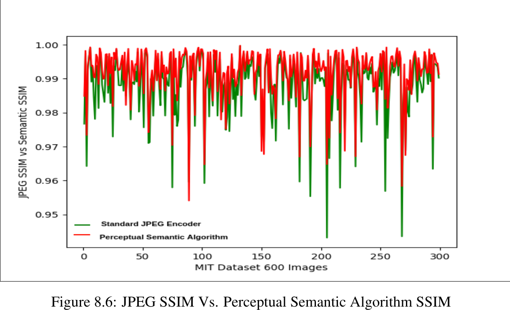

# Semantic Perceptual Image Compression

## Abstract

This project implements a semantic, perceptual image compression pipeline that uses a convolutional model to identify regions of interest in an image and allocate compression quality accordingly. The result is intended to preserve visually important content while reducing overall image size.

The main entry point processes a single image from the command line, generates the compression output, and saves intermediate visualizations such as the ROI heatmap.



## Directory Structure

- `image_compressor.py`: command-line entry point for compressing a single image
- `compression.py`: main compression pipeline and ROI-based quality allocation
- `model.py`: CNN and feature extraction logic used by the compressor
- `util.py`: image loading, resizing, normalization, and helper utilities
- `jpeg_compression.py`: baseline JPEG compression helper
- `benchmark_test.py`: benchmark script for comparing compression outputs
- `get_metrics.py`: metric collection and reporting utilities
- `graph.py`: plotting utilities for compression results
- `Image_compression_deployment/`: deployment-oriented copy of the project
- `Image Quality Assessment Tools/`: PSNR, SSIM, and related evaluation scripts

## Installation

Install the required dependencies:

```bash
pip3 install -r requirements.txt
```

The project also expects CUDA-enabled TensorFlow dependencies if you are running the original GPU-based setup.

## Commands

Run compression on a single image:

```bash
python3 image_compressor.py path/to/single_image.jpg
```

The script loads the input image, runs the compression pipeline, and writes output files to the project folders used by the code.

If you need the original invocation with elevated privileges, you can also run:

```bash
sudo python3 image_compressor.py path/to/single_image.jpg
```

## Notes

- The compressor expects a file path to one image, not a directory or glob pattern.
- Output artifacts are written by the script into the local `output/` directory and related generated files in the project root.
